---
papersize:
- a4
geometry:
- margin=1in
---

# KiCAD - Adding Libraries to your project

\tableofcontents
\newpage

## Introduction

In KiCAD (and any ECAD software), a symbol refers to a graphical representation of a component used in electronic circuit design. Symbols are used to represent various electronic components such as resistors, capacitors, integrated circuits, and more. Each symbol typically includes graphical elements that depict the component's schematic representation, such as lines, shapes, and labels.

KiCad provides a library of pre-defined symbols for commonly used electronic components, and users can also create custom symbols as needed. Additionally, KiCad supports the import and export of symbol libraries in various formats, allowing users to share and reuse symbols across different projects and with other designers.

{width=50%}

A footprint, refers to the physical layout or arrangement of metal pads, holes, and other features on a printed circuit board (PCB) that corresponds to a specific electronic component. The footprint represents the space and connection points required for soldering or mounting the component onto the PCB.

Footprints are crucial in the PCB design process as they ensure proper alignment, spacing, and connectivity of components on the board. Each electronic component, such as resistors, capacitors, integrated circuits, connectors, etc., typically has its own unique footprint that matches its physical dimensions and pin configuration.

Key elements of a footprint include:

- **Pads**: These are exposed metal areas on the PCB where components are typically soldered. Pads provide electrical connections between the component leads and the PCB traces. A component can be mounted either Through-hole (THT) or Surface mounted (SMD). In the case of Through-hole, the pins/leads of the component will go through the board; while the pins/leads of a SMD component sit on top of the pads on bottom or top surface of the board.
- **Silkscreen Markings**: These are non-conductive markings on the PCB that indicate component outlines, reference designators, polarity markings, or other important information to assist in assembly and troubleshooting.
- **Keep-Out Areas**: These are designated areas on the PCB where components or traces should not be placed to prevent interference or short circuits.

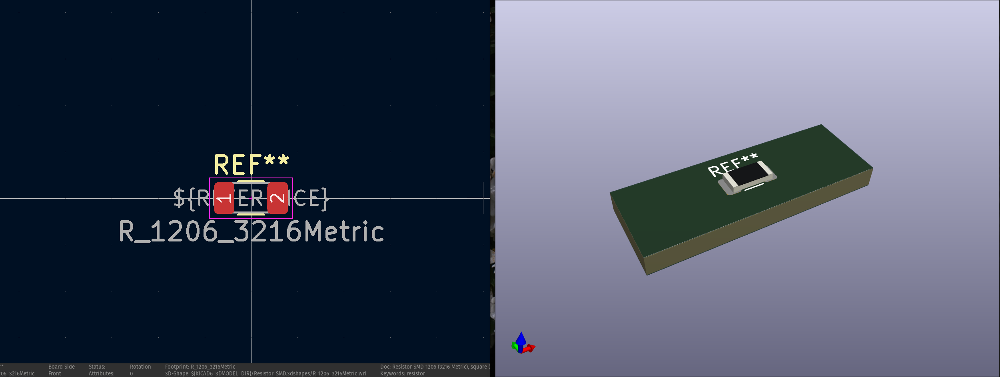

The image above shows a footprint (left) for a resistor. As well a 3D model of the component on the right. The area in red on the footprint is a pad.

Figure 3 shows another footprint for a resistor, in this case a through hole footprint for a specific package of resistor.

If we were to look at the through-hole footprint in Figure 4, the yellow is pad which will be on the top and underside of the board. In all three of the footprints shown above, there is silkscreen. The silkscreen for this component is specified as "REF**" which is a special string that will get replaced with the value of the resistor on the schematic. On your PCB this value wil be visible on the silkscreen layer.

A package refers to the physical casing or enclosure that houses the semiconductor die or other active elements of the component. It provides mechanical support, protection, and electrical connections for the internal circuitry. Packages come in various shapes, sizes, and configurations depending on the type and application of the electronic component. 

While both footprint and package relate to the physical aspects of electronic components, a footprint specifically refers to the layout on the PCB where the component will be mounted, while a package refers to the physical casing or enclosure of the electronic component itself.

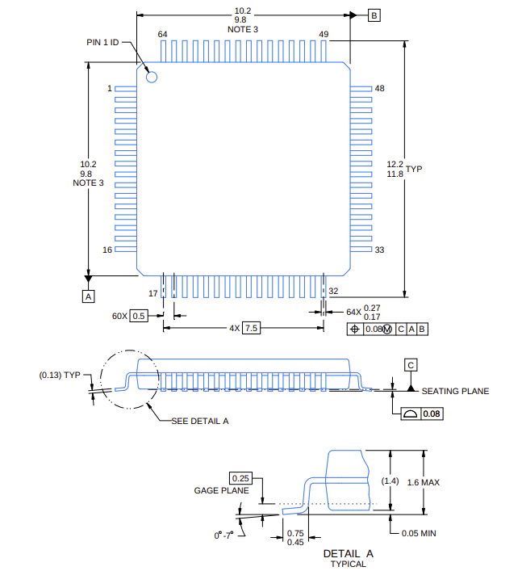

## Finding Symbols and Footprints 

There are a variety of ways of including symbols within your project. You can find them in these following sources

- **Built-in Libraries**: KiCad comes with a set of built-in libraries containing commonly used symbols and footprints. These libraries cover a wide range of electronic components. You can access these libraries directly within the KiCad software.

- **Official KiCad Libraries**: The KiCad project maintains official libraries that are regularly updated and expanded. These libraries contain a comprehensive collection of symbols and footprints for various components.  

- **Third-Party Libraries**: There are many third-party libraries available online that provide additional symbols and footprints for KiCad. These libraries may cover specialized components or offer alternative options to the built-in libraries. You can find these libraries on websites such as GitHub, GitLab, or dedicated KiCad library repositories. With some installs of KiCAD, these libraries may already be installed alongside your KiCAD installation, these can be founde in the "3rdparty" folder of your KiCAD installation.

- **Component Manufacturers and Vendors**: Many component manufacturers provide downloadable libraries containing symbols and footprints for their products. These libraries are often available on the manufacturer's website and may include accurate and up-to-date models for their components. When sourcing components from vendors such as Mouser or Digikey, these vendors may have links to the symbols and footprints on their product page.

- **Community Contributions**: KiCad has a large and active community of users who contribute to the development of libraries. You can find user-contributed libraries, symbols, and footprints on forums, discussion boards, and community-driven websites. These contributions may cover a wide range of components and offer additional options for your designs.

- **Creating Custom Symbols and Footprints:** If you cannot find a specific symbol or footprint for your component, you can create custom ones using the KiCad footprint and symbol editors. This allows you to tailor the design to your exact specifications and requirements.

Different ECAD softwares such as Autodesk Eagle, Altium, KiCAD have different formats for symbols and libraries. As of the time of writing (Spring 2024) KiCAD 8 will be releasing soon, a major feature of this release includes the capability to import symbols from other software such as EAGLE.

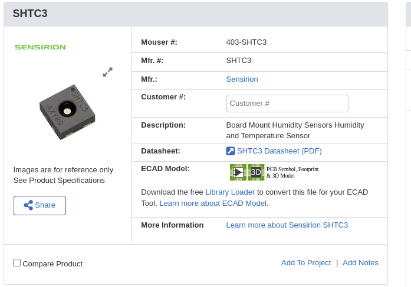

Services such as SnapEDA provide repositories to lookup symbols and footprints for components. These can be exported to a variety of ECAD software.

## Adding Symbol Libraries

KiCad uses a table of symbol libraries to map a symbol library nickname to an underlying symbol library on disk. There are two symbol library tables:

- **Global Symbol Library Table**: the list of libraries that are always available regardless of the currently loaded project.
- **Project Symbol Library Table**: the list of libraries that are available specifically for the currently loaded project.

To manage your symbol libraries, use in the toolbar `Preferences - Manage Symbol Libraries`

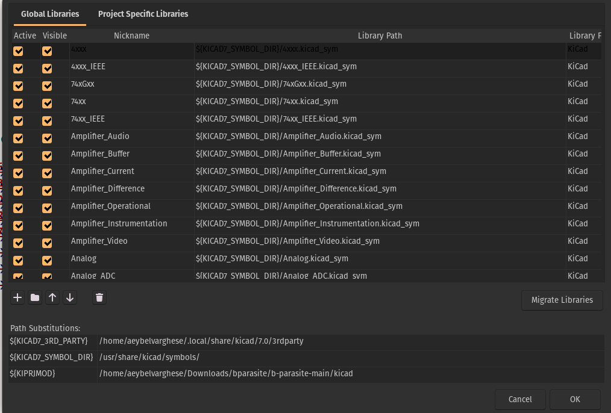{width=75%}

KiCAD Symbol libraries end with the extension `.kicad_sym` or `.lib` (legacy, comes bundled with footprints). When you download or create symbol libraries. It is a good idea to store the libraries in a reasonable location. For example, the ECE 445L symbols library would be best suited in a file location outside of inindividual lab projects. While project specific symbols are best suited within the project folder. Within the basline project we have a folder called `symbols` which contains project specific symbols, `footprints` which contains project specific footprints, and `models` which will contain 3D models for various footprints. 

If we were too look at the `symbols` folder within the baseline project, we have symbols for the components we will be using within the lab such as for the ESP, TM4C, ST7735 Breakout board from Adafruit, etc.

Even if you download a symbol library, they can only be used if they have been added to either the global or project-specific symbol library table. You can add a entry to the table via the "+" button and typing the path, in this mode we can use path substitutions. Otherwise can can browse to the file using the file icon.

{width=75%}

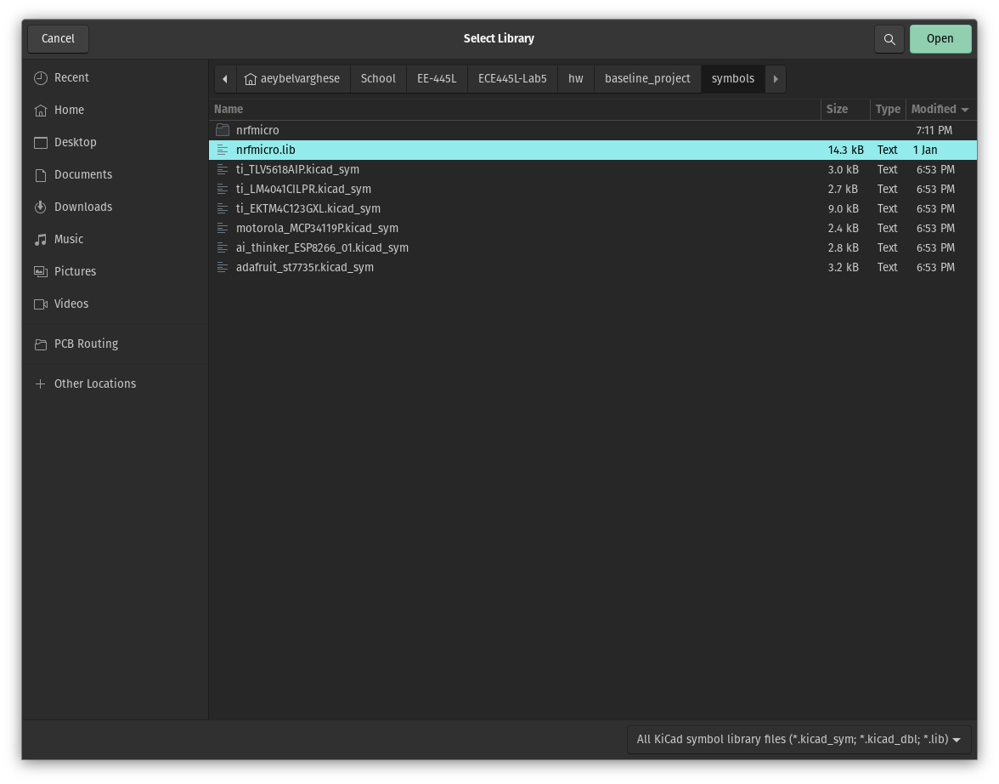{width=75%}

When a symbol library is added, it will be present in the symbol library table.

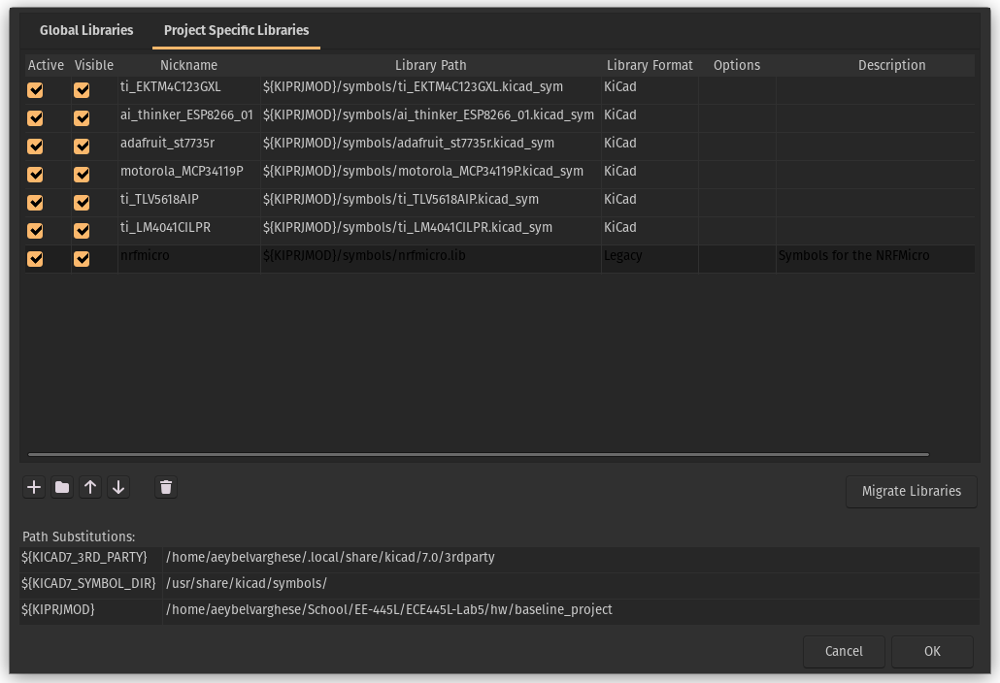{width=75%}

The symbol is now ready for use. If I were to add the symbol to the schematic, it will be visible in the "Add Symbol" Window. If any footprints are linked with that symbol, we can choose it as we add the symbol. Footprints can be changed at any time using the footprint assignment tool.

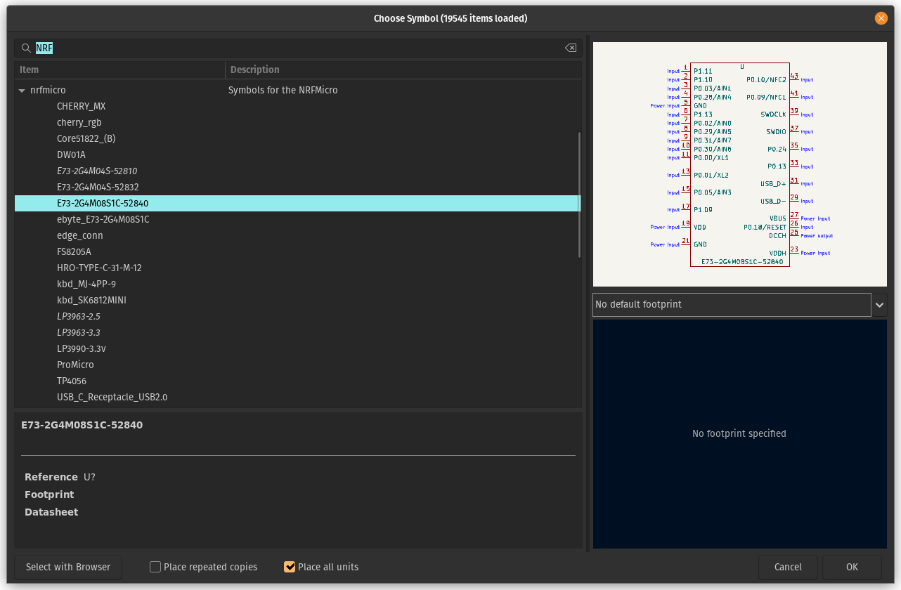{width=75%}

We can then add the symbol to our schematic.

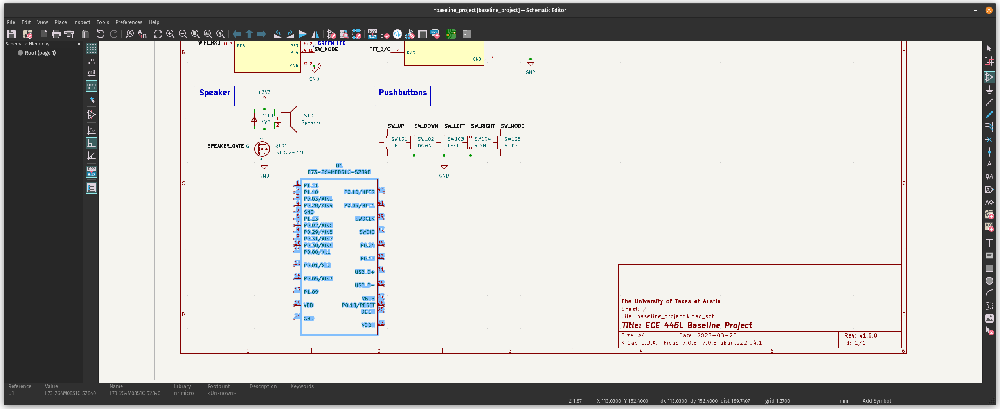

## Adding Footprint Libraries 

The same logic applies for adding footprint libraries. A symbol can have a variety of footprints. To manage footprints, go to `Preferences - Manage Footprint Libraries`. Similarily to the symbol library tables, we have footprint library tables.

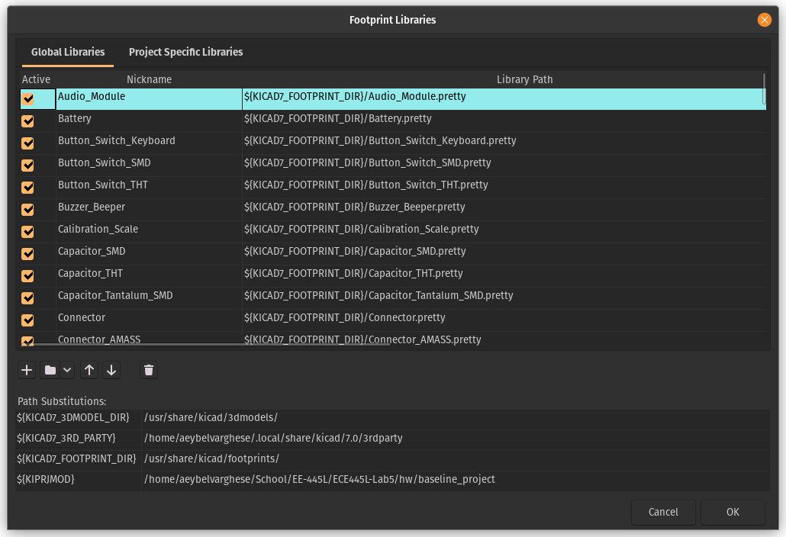{width=75%}

We can add a entry to the table similarily to how we did in symbols, the only difference is that instead of having a entry pointing to a symbol file, for a footprint a entry points to the *folder* which contains the footprint. KiCAD footprints are stored as `.kicad_mod` files. In previous version of KiCAD, symbols and footprints would be bundled as `.lib` files. 

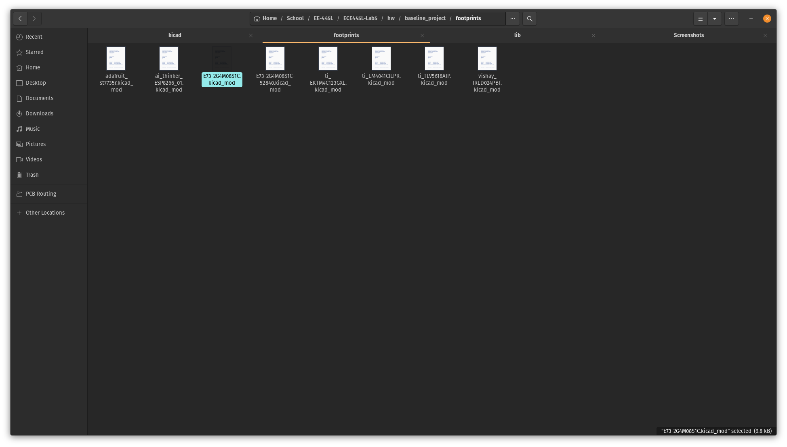{width=75%}

In this case we had a entry for footprints, so I added the footprint for the NRFMicro to the footprints folder. 

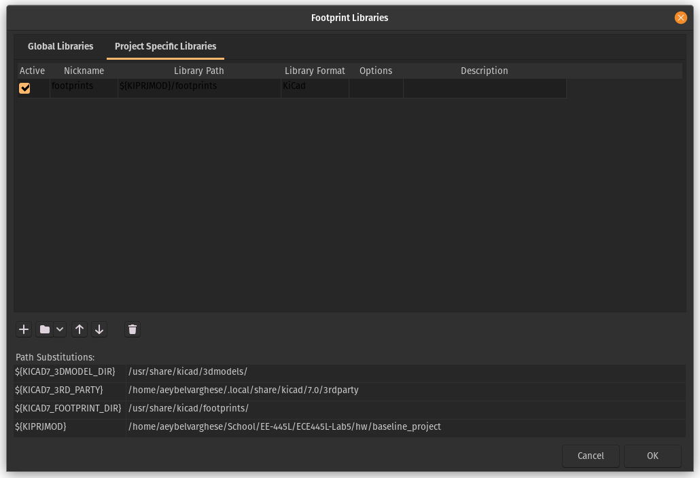{width=75%}

Footprints can be assigned to symbols within your schematic using the footprint assignment tool 

Within the footprint assignment tool, symbols with unnasigned footprints are highlighted in yellow.

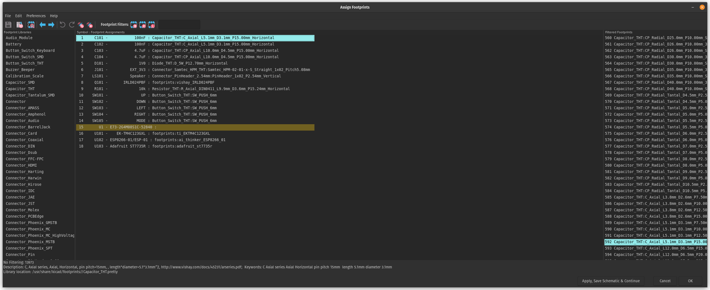

You select a symbol from your circuit in the middle pane, then double click the footprint you want to assign to that symbol in the right pane. A footprint can be viewed by right clicking it and selecting "View Footprint".

When you update your PCB with changes from the schematic, the footprint will be visible in the PCB editor 

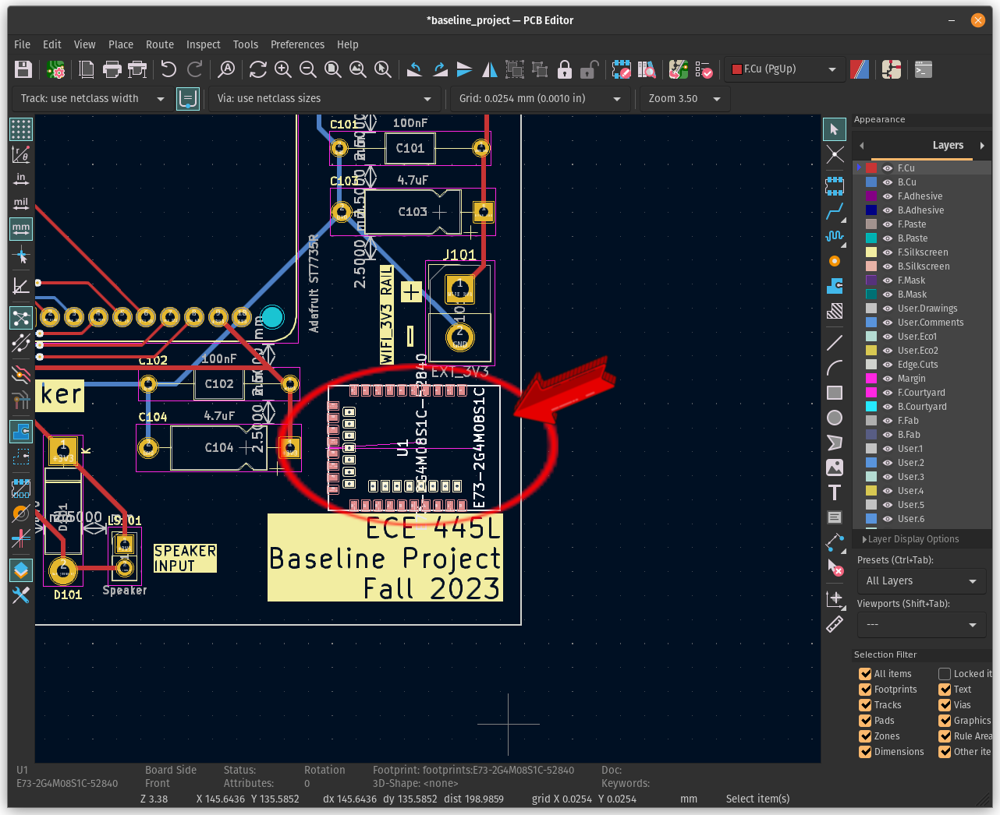

The footprint can also be visible in the PCB 3D viewer. 

## Adding 3D Models 

KiCAD has a 3D Viewer for visualizing 3D Models. This can be bought up in the PCB Editor via `View-3D Viewer` or the `Alt-3` keyboard shortcut.

Similar to how footprints can be assigned to symbols, a 3d model can be assigned to a footprint. To do so we first need to edit the footprint in the Footprint Editor 

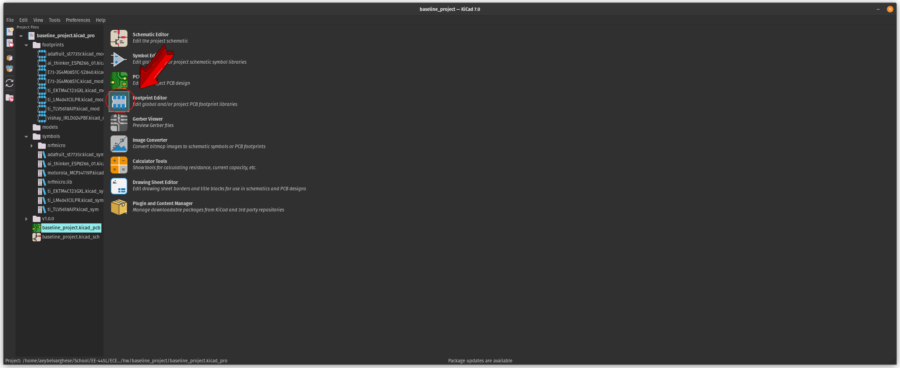

Navigate to the footprint we want to edit. 

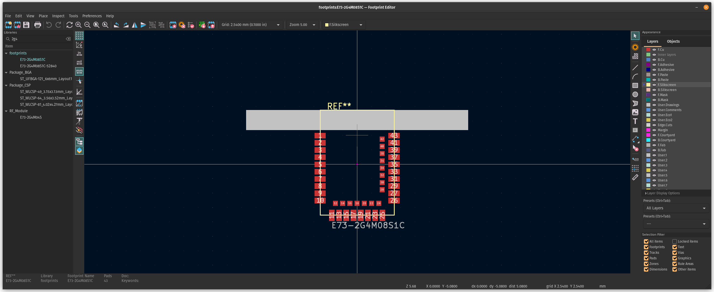

Select footprint properties within the toolbar.

Within the footprint properties, we can see the 3d model(s) of the footprint. We can add one via the "+" button to add a path, or browse to it via the file icon. I use the file icon to navigate to the 3D Model of the component.

Once a 3D Model has been imported, adjust parameters such as scale, rotation, and offset such that the components fits in the correct position. 

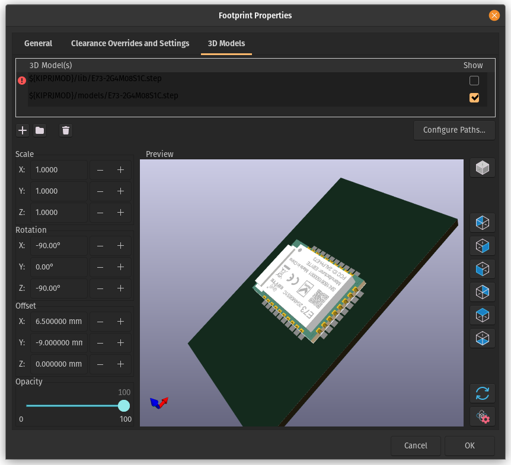

Once the footprint has a 3D model, update your PCB and you should now see the 3D model within the 3D viewer.

